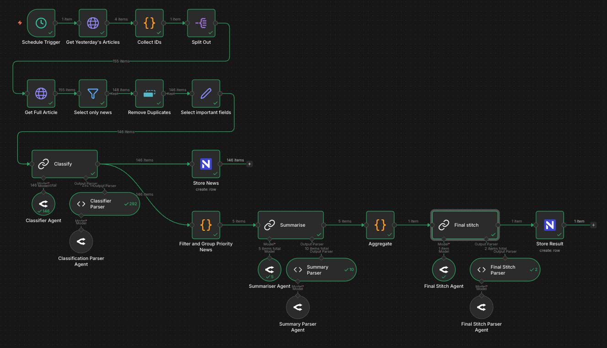

# n8n Automation Workflow

The core logic of the News Summary Agent is orchestrated using n8n. This workflow fetches raw news data, classifies it using AI, summarises important stories, and generates a curated homepage structure.

## Workflow Overview

The "News Agent" workflow performs the following steps sequentially:

### 1. Ingestion
- **Trigger**: Runs on a scheduled interval (e.g., daily).
- **Fetch Data**: Queries the **Linkwarden API** to retrieve articles archived in the last 24 hours.
- **Preprocessing**: 
  - Splits items into individual records.
  - Removes duplicates based on URL.
  - Selects relevant fields (Title, Content, URL, Created At).

### 2. Classification & Filtering
- **Classifier Agent (AI)**: Uses an LLM (e.g., Grok via OpenRouter) to analyze each article's metadata.
  - **Categorization**: Assigns a category (International Affairs, Politics & Government, Economy & Business, Social & Humanitarian, Sports & Culture).
  - **Prioritization**: Assigns a priority score (1-10) based on relevance to Indonesia and global significance.
  - **Breaking News Detection**: Flags articles as "breaking" if applicable.
- **Filter**: Retains only articles with high priority (Priority > 7) for the summary.
- **Storage**: Saves individual high-relevance news items to the **NocoDB News Table**.

### 3. Summarization
- **Grouping**: Articles are grouped by their assigned category.
- **Summariser Agent (AI)**: For each category, an LLM synthesizes multiple source articles into unified "Storylines".
  - **Conflict Resolution**: Notes discrepancies between sources.
  - **Extraction**: Generates a headline, a 2-3 sentence summary, and key takeaways.
  - **Attribution**: Preserves original source URLs.

### 4. Curation (The "Final Stitch")
- **Final Stitch Agent (AI)**: Acts as the Editor-in-Chief.
  - **Hero Selection**: Selects the most impactful story to be the "Hero" section of the homepage.
  - **Structure Generation**: Organizes the remaining stories into:
    - **At a Glance**: Quick updates.
    - **Categorized Sections**: Detailed storylines by category.
- **Output Generation**: Produces a structured JSON object conforming to the `CuratedHomepage` schema.
- **Storage**: Saves the final JSON blob to the **NocoDB Curated Homepage Table**.

## Agents & Models

The workflow utilizes LangChain nodes within n8n to interface with LLMs via OpenRouter.

- **Classifier**: `x-ai/grok-4.1-fast` - Fast analysis of individual articles.
- **Summariser**: `x-ai/grok-4.1-fast` - Synthesis of multiple texts.
- **Final Stitch**: `x-ai/grok-4.1-fast` - Structural organization and final polish.

*(Note: Models may vary based on configuration in `News Agent.json`)*
